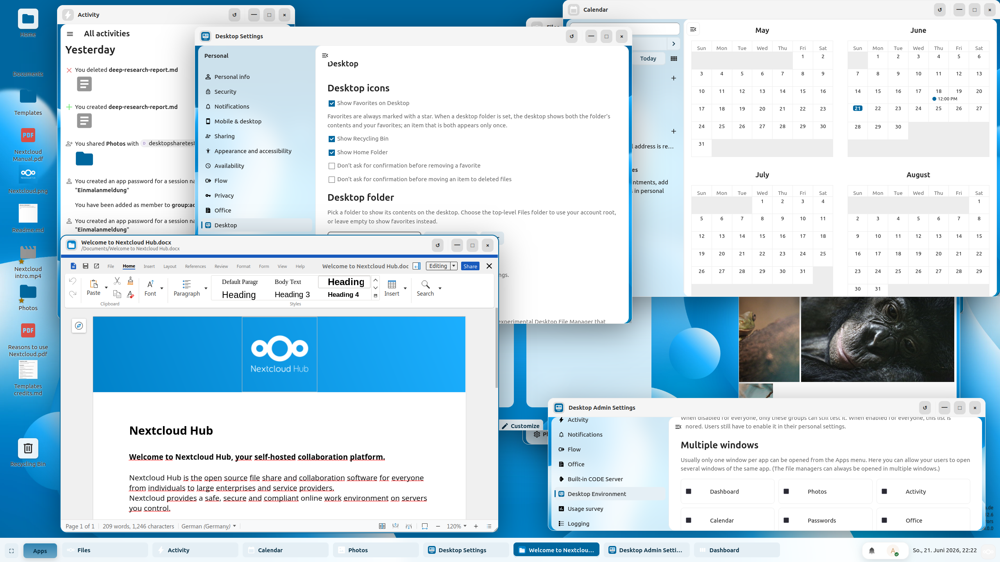

# Desktop Workspace for Nextcloud

A browser-contained **desktop workspace** for Nextcloud. Instead of juggling browser tabs, open
Nextcloud apps as draggable, resizable windows on a familiar desktop — with a taskbar, a clock,
desktop icons, and an optional built-in file manager.



> **Status:** early development (0.x). Targets **Nextcloud 33, 34**.

---

## Features

- **App windows** — open Nextcloud apps (Files, Mail, Calendar, …) as draggable, resizable,
  minimizable, maximizable windows. Snap to screen edges for tiling.
- **Taskbar & clock** — running windows appear in a taskbar; a clock/date sits in the panel.
- **Desktop icons** — show your **Favorites** and/or the contents of a chosen **desktop folder**
  as icons, with drag-to-arrange positions, a recycling bin, and a home shortcut.
- **Drag-and-drop upload** — drop files from your computer onto the desktop to upload them into the
  desktop folder, with a progress bar.
- **Built-in file manager (experimental)** — *Desktop Files*, a lightweight in-shell file manager
  with a "+ New" menu, cut/copy/paste, rename, drag-and-drop, and a viewer that hands off to the
  native Nextcloud viewer.
- **Window & icon state is saved to your account** — open windows reopen where you left them (at
  their last location), and icon positions follow you across devices.
- **Header & account menu integration** — the Nextcloud header links open as Desktop Workspace
  windows; "Set status" and global search open as native overlays.
- **Per-user and per-admin settings** — including a first-visit onboarding, full per-user reset,
  and an admin "reset a single user" action.
- **Localized** — covers the Nextcloud language set where reliable translations are available.

---

## Requirements

- Nextcloud **33** or **34**
- A standard Nextcloud app environment (PHP per the Nextcloud 33 requirements)

---

## Installation

### From a release tarball

1. Download the latest `desktop_workspace-<version>.tar.gz`.
2. Extract it into your Nextcloud `custom_apps/` (or `apps/`) directory so the path is
   `…/custom_apps/desktop_workspace/`.
3. Enable the app:
   ```bash
   occ app:enable desktop_workspace
   ```
4. Open **Desktop Workspace** from the app navigation.

### From source

```bash
git clone <this-repo> desktop_workspace
cd desktop_workspace
make            # builds build/appstore/desktop_workspace-<version>.tar.gz
```

Place the resulting `desktop_workspace` folder in your Nextcloud apps directory and enable it as above.

---

## Configuration

### Personal settings (per user)

**Settings → Desktop**. Changes apply immediately:

- **Desktop icons** — show favorites, recycling bin, home folder; confirmation prompts.
- **Desktop folder** — pick a folder you own to show on the desktop.
- **Wallpaper** — jump to Nextcloud's appearance settings.
- **Experimental** — opt in to the *Desktop Files* manager (if enabled by the admin).
- **Reset** — reset icon positions, reset open windows, or **reset all desktop settings** (as if
  the desktop had never been opened).

### Admin settings

**Administration settings → Desktop Workspace**:

- Enable/disable the **experimental Desktop Files** manager (optionally per group).
- Configure **multiple-window** behavior per app.
- **Debug logging** to a log file.
- **Reset a single user's** desktop settings completely.
- Basic **usage stats** (unique users per day/week).

---

## License

Licensed under the **GNU Affero General Public License v3.0 or later** (AGPL-3.0-or-later), in line
with Nextcloud apps.
